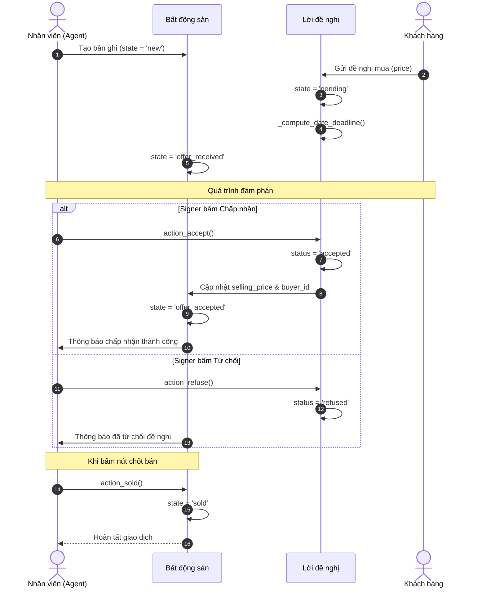
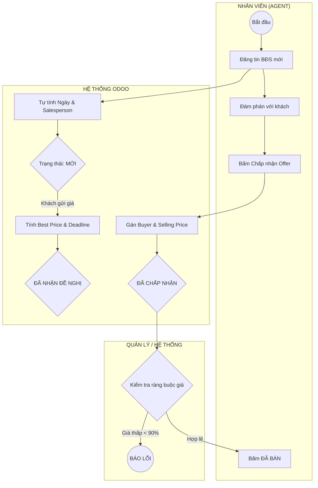
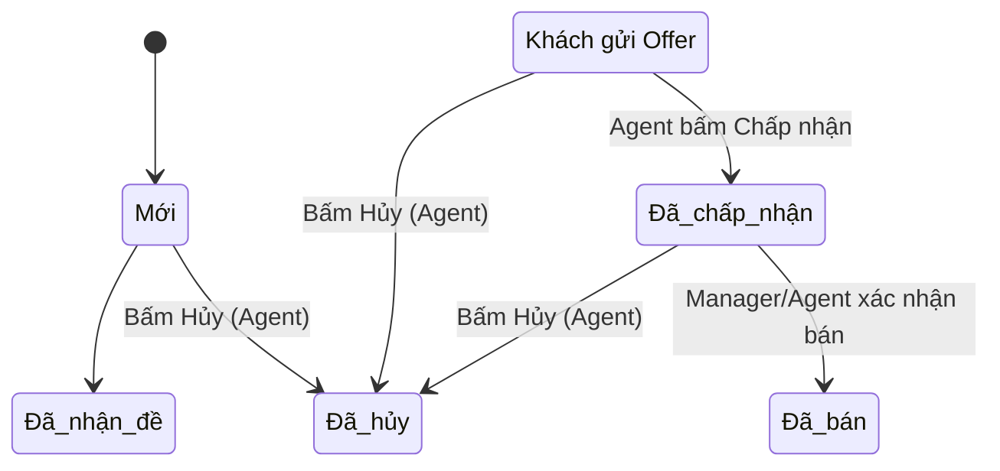

# Luồng hoạt động (Workflow) - Module Quản lý Bất động sản

## 0. Sơ đồ tuần tự xử lý (Sequence Diagram)

## 1. Sơ đồ quy trình (Workflow Swimlane)

## 1. Sơ đồ trạng thái chi tiết (State Diagram)

Tài liệu này giải thích cách thức vận hành của module `estate` từ góc độ người dùng và logic hệ thống Odoo.

## 1. Sơ đồ trạng thái của Bất động sản (Property States)

Một bản ghi Bất động sản (`estate.property`) sẽ trải qua các giai đoạn sau:

1.  **Mới (New):** Trạng thái mặc định khi vừa tạo tin đăng.
2.  **Đã nhận đề nghị (Offer Received):** Tự động chuyển khi có khách hàng gửi lời đề nghị mua đầu tiên.
3.  **Đã chấp nhận (Offer Accepted):** Chuyển sau khi Nhân viên bấm nút **Chấp nhận (✓)** trên một lời đề nghị cụ thể.
4.  **Đã bán (Sold):** Trạng thái cuối cùng sau khi bấm nút **Đã bán** trên thanh công cụ (Header).
5.  **Đã hủy (Canceled):** Trạng thái dừng giao dịch (có thể thực hiện bất cứ lúc nào trừ khi đã bán).

---

## 2. Quy trình mua bán chi tiết

### Bước 1: Đăng tin
*   Nhân viên tạo bản ghi, nhập **Giá mong muốn** (Expected Price).
*   **Logic:** Hệ thống tự động tính **Ngày có hiệu lực** (3 tháng sau) và gán mặc định người tạo là **Nhân viên phụ trách**.

### Bước 2: Nhận đề nghị mua (Offers)
*   Khách hàng gửi giá đề nghị thông qua tab **Lời đề nghị mua**.
*   **Tính toán tự động:**
    *   Trạng thái nhà tự động chuyển sang "Đã nhận đề nghị".
    *   Trường **Giá đề nghị tốt nhất** trên Form chính sẽ tự động cập nhật mức giá cao nhất hiện có.
    *   Hạn chót của đề nghị tự động tính dựa trên số ngày hiệu lực nhập vào.

### Bước 3: Đàm phán và Chốt giá
*   Nhân viên xem xét các đề nghị:
    *   Bấm **✗ Từ chối**: Đề nghị chuyển sang màu đỏ.
    *   Bấm **✓ Chấp nhận**: 
        *   **Ràng buộc:** Không được chấp nhận giá thấp hơn 90% giá mong muốn (nếu không được Quản lý cho phép).
        *   **Tự động hóa:** Hệ thống ghi nhận khách hàng này là người mua, cập nhật **Giá bán thực tế**, và chuyển trạng thái nhà sang "Đã chấp nhận".

### Bước 4: Hoàn tất giao dịch
*   Nhân viên bấm nút **Đã bán**.
*   **Kiểm tra:** Hệ thống yêu cầu phải có 1 đề nghị đã được chấp nhận mới cho phép kết thúc.

---

## 3. Các tính năng thông minh (Automation)

*   **Smart Buttons:** Ở góc trên Form BĐS có một nút hiển thị số lượng đề nghị. Bấm vào đó sẽ lọc ra toàn bộ các đề nghị dành riêng cho nhà đó.
*   **Tab Khách hàng:** Khi vào menu **Contacts**, chọn người mua, bạn sẽ thấy ngay danh sách những ngôi nhà họ đã mua thông qua tab **Bất động sản đã mua**.
*   **Kéo thả (Kanban):** Bạn có thể xem nhà theo dạng thẻ và kéo thả để thay đổi trạng thái (nếu được cấu hình cho phép).

---

## 4. Phân quyền và Bảo mật

Hệ thống chia làm 2 cấp bậc:

*   **Nhân viên (Agent):**
    *   Được tạo mới, sửa tin đăng.
    *   Chỉ nhìn thấy những căn nhà **do chính mình phụ trách** hoặc chưa có ai nhận (Dùng Record Rule).
*   **Quản lý (Manager):**
    *   Thấy toàn bộ dữ liệu của tất cả nhân viên.
    *   Có quyền xóa bản ghi hoặc cấu hình các Loại BĐS/Nhãn.

---

## 5. Báo cáo (Reporting)

*   **Xuất PDF:** Bấm nút **In (Print)** để lấy file PDF tóm tắt làm hồ sơ gửi khách hàng.
*   **Phân tích (Pivot/Graph):** Dùng để thống kê xem nhân viên nào bán nhiều nhất, hoặc loại nhà nào đang thu hút nhiều đề nghị nhất.
